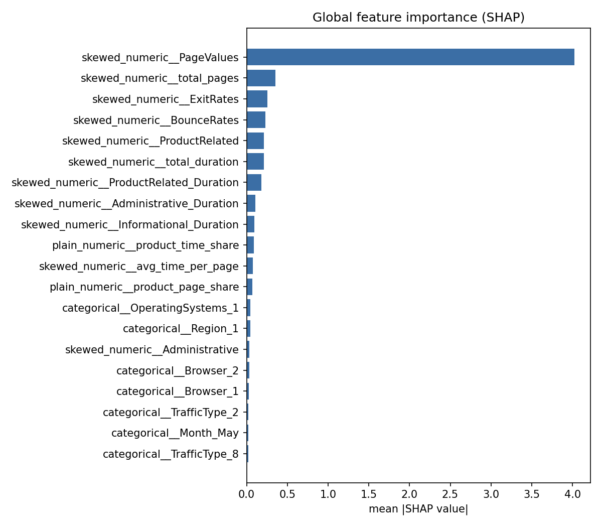

# Purchase-Intent XAI

End-to-end, production-style ML system that predicts whether an online
shopping session will end in a purchase, explains every prediction, and
serves it through a REST API and an analytics dashboard — built following
CRISP-DM from raw CSV to a deployable, monitored service.

Built from a 4-week capstone brief (`docs/` original PRD context). Only
~15.7% of sessions convert, so the project is judged on leak-free handling of
mixed data, honest imbalance-aware evaluation, a defensible decision
threshold, working explanations, and train/serve parity — not a single
accuracy number.

## Results at a glance

Six algorithms compared via 5-fold stratified cross-validation, ranked by
PR-AUC (imbalance-aware headline metric):

| Rank | Model | CV PR-AUC | CV ROC-AUC | CV Recall |
|---|---|---|---|---|
| 1 | **catboost** ⭐ | 0.8434 | 0.9671 | 0.8893 |
| 2 | xgboost | 0.8348 | 0.9650 | 0.8542 |
| 3 | lightgbm | 0.8316 | 0.9640 | 0.8105 |
| 4 | random_forest | 0.8243 | 0.9622 | 0.7946 |
| 5 | logistic_regression | 0.8198 | 0.9643 | 0.9264 |
| 6 | decision_tree | 0.7984 | 0.9484 | 0.9046 |

**Selected model: CatBoost.** On the held-out test set at the value-based
decision threshold (0.024, chosen from illustrative
value_per_conversion=$50 vs cost_per_intervention=$2 in `config.yaml`):

| Metric | Value |
|---|---|
| PR-AUC | 0.859 |
| ROC-AUC | 0.972 |
| Recall (buyers) | 0.997 |
| Precision | 0.434 |
| F1 | 0.605 |
| Accuracy | 0.795 |

That threshold captures 376/377 held-out conversions via 866 triggered
interventions — recall-heavy because, at these illustrative business
numbers, a missed sale costs far more than a wasted intervention. Change
`threshold.value_per_conversion` / `cost_per_intervention` in
`src/config/config.yaml` and re-run `python -m src.train` to see the
optimal threshold move for your own numbers. Full details, including the
PageValues leakage decision, are in `docs/model_card.md`.

**Global SHAP summary:**



PageValues dominates — flagged in EDA and cross-checked with an independent
LIME explanation at the session level (see `notebooks/04_xai.ipynb`).

## Quickstart

```bash
python -m venv .venv && source .venv/bin/activate
pip install -r requirements.txt

python -m src.train              # 6-model CV, saves best model + pipeline
python -m src.train_explainers   # SHAP/LIME explainer + model card

uvicorn src.api.main:app --reload --port 8000   # API: localhost:8000/docs
streamlit run dashboard/app.py                   # Dashboard: localhost:8501
```

Or everything containerised: `docker compose up --build` (train locally
first — see `docs/install_guide.md`).

## Project structure

```
purchase-intent-xai/
├─ dataset/            #  ecommerce_sessions.csv + data_dictionary.csv
├─ notebooks/           # 01_eda, 02_features, 03_modeling, 04_xai
├─ src/
│  ├─ config/           # config.yaml + typed pydantic settings loader
│  ├─ data/              # ingestion + schema validation
│  ├─ preprocessing/    # leak-free ColumnTransformer: encode, scale
│  ├─ features/          # behavioural feature engineering
│  ├─ models/            # trainer classes (6 algos, common interface), CV eval
│  ├─ explain/            # SHAP + LIME wrapper
│  ├─ api/                # FastAPI app, Pydantic schemas
│  ├─ train.py            # end-to-end training entrypoint
│  ├─ train_explainers.py # explainer + model card + SHAP plot
│  └─ utils/              # logging, io, metrics
├─ dashboard/            # Streamlit app (6 sections)
├─ models/               # saved artifacts (model, preprocessor, explainer, report)
├─ tests/                 # pytest suite
├─ docker/                # Dockerfile.api, Dockerfile.dashboard
├─ .github/workflows/    # CI: lint, format check, test, build
├─ docs/                  # this doc set + model card + diagrams
├─ docker-compose.yml
├─ requirements.txt
└─ pyproject.toml        # black/ruff/pytest config
```

## Documentation

- [`docs/architecture.md`](docs/architecture.md) — layered architecture + sequence diagrams
- [`docs/install_guide.md`](docs/install_guide.md) — setup, training, running, testing
- [`docs/api_docs.md`](docs/api_docs.md) — `/predict` / `/health` reference
- [`docs/user_guide.md`](docs/user_guide.md) — dashboard walkthrough
- [`docs/model_card.md`](docs/model_card.md) — generated: intended use, data, performance, limitations
- [`docs/aws_deployment.md`](docs/aws_deployment.md) — cloud deployment notes (stretch goal)

## Key engineering decisions

- **Leak-free by construction.** Encoders, scalers, and the imbalance
  strategy live inside a single `ColumnTransformer`/`Pipeline`, fit only on
  training folds — never on the full dataset before splitting.
- **Int-coded IDs treated as categorical.** `OperatingSystems`, `Browser`,
  `Region`, `TrafficType` are one-hot encoded, not scaled as continuous
  quantities.
- **PR-AUC and buyer-recall lead, not accuracy.** At ~15.7% positive
  prevalence, an all-negative classifier scores ~84.5% accuracy while
  catching zero buyers.
- **Value-based threshold, not 0.5.** Chosen by sweeping the PR curve against
  a configurable cost/value trade-off (`src/utils/metrics.py`).
- **Train/serve parity.** The API loads the *exact same* fitted pipeline
  object `src/train.py` saved — no hand-reimplemented preprocessing in the
  serving path. Unseen categories degrade gracefully
  (`OneHotEncoder(handle_unknown='ignore')`).
- **Explainability at serving time, not just in notebooks.** SHAP + LIME are
  cached once and surfaced live in both `/predict` and the dashboard.

## Testing & quality

```bash
python -m pytest tests/ -q --cov=src
python -m black --check src/ dashboard/ tests/
python -m ruff check src/ dashboard/ tests/
```

CI (`.github/workflows/ci.yml`) runs lint, format check, trains the model,
runs the test suite, and builds both Docker images on every push.

## Responsible use

This is anonymised session behaviour, but the techniques generalise to real
user tracking. Predictions are never tied to personally identifying fields;
the intervention decision itself remains a human/business call. See the
Responsible Use section of `docs/model_card.md`.
